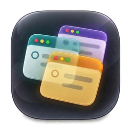

  <a href="https://apps.apple.com/app/maketask/id6811447937"><strong>Download on the Mac App Store →</strong></a> 
  Free · macOS 14+ · No account needed

  

<h1 align="center">MakeTask</h1>

<strong>Your tasks, right on your desktop.</strong>

Keep your tasks in view with colorful desktop notes for work, personal projects, and everyday life. Capture ideas with Quick Add, then get back to what you were doing.

## A little space for everything you need to do

- **Lists that stay in sight.** Give each project its own desktop note. Move, resize, or roll it up when you need more room.
- **Capture a thought in seconds.** Press `⌘⇧Space` to open Quick Add from any app and add a task to your list.
- **Make the next step clear.** Break tasks into subtasks and add notes, priorities, and due dates.
- **Make it feel like yours.** Choose from ten note colors, light or dark appearance, and adjustable transparency.
- **Your tasks stay on your Mac.** Work offline, without accounts, ads, or analytics. Export a local backup whenever you want.

## Get started

1. **Open MakeTask** and create your first list.
2. **Add a few tasks.** Click a task title for details, or its circle to mark it complete.
3. **Keep it close.** Place your note where it helps you most, and use Quick Add whenever something comes to mind.

MakeTask lives in the **menu bar** at the top of your screen. Click its icon to find your lists, open Settings, or view the built-in Guide.

## A few handy shortcuts

| To… | Press… |
| --- | --- |
| Quickly add a task from any app | `⌘⇧Space` |
| Show or hide all notes | `⌘⇧H` |
| Find a task in the active note | `⌘F` |
| Undo the last action | `⌘Z` |

Customize these in **Settings → Shortcuts**. You can also double-click an empty area of a note's header to roll it up or expand it.

## Help and more

- **[Support & feedback](https://github.com/OrhunMahir/MakeTask/issues)** — report a problem or suggest an idea.
- **[Features & shortcuts](docs/GUIDE.md)** — explore the full reference.
- **[Privacy policy](docs/PRIVACY.md)** — how MakeTask keeps your data local.
- **[Source code](https://github.com/OrhunMahir/MakeTask) · [Developer guide](docs/DEVELOPMENT.md)** — build, test, or contribute. Open source under the [MIT License](LICENSE).

  <a href="https://apps.apple.com/app/maketask/id6811447937"><strong>Download MakeTask on the Mac App Store →</strong></a>

