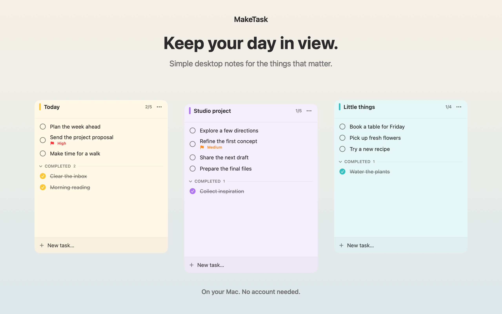
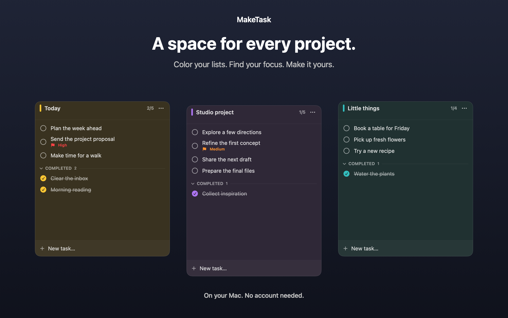
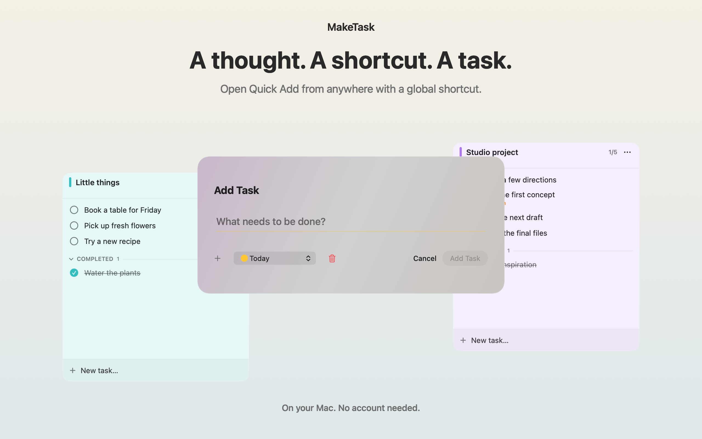

# Mac App Store screenshots

Three English screenshots, each **2560 × 1600**, opaque RGB PNG:

1. `01-desktop-notes.png` — independent notes, colors, priorities, and completed tasks.
2. `02-dark-appearance.png` — the same real note views in dark appearance.
3. `03-quick-add.png` — the actual Quick Add form over two desktop notes.







## Regenerate

From the repository root, in a logged-in macOS desktop session with Xcode:

```sh
./scripts/capture-store-screenshots.sh
```

Run this separately from other test sessions. The script temporarily adds a capture test, renders the production `NoteView` and `QuickAddView` with sample data in an in-memory store, copies the PNG files here, and removes the temporary test. It does not open the real task database or register global shortcuts. Its logs and DerivedData remain under ignored `build/`.

The capture source is [CaptureStoreScreenshots.swift](../Tools/CaptureStoreScreenshots.swift). Text and the opaque background are presentation elements; note and form content come directly from the app. No stock images, private task data, or other applications are included. Note transparency is disabled, an available preference in the shipping app.

All three images were visually inspected for text, clipping, and real feature accuracy. Pixel dimensions and absence of an alpha channel were checked with `sips`. Recheck regenerated images before uploading, especially after UI or macOS changes. Apple's [Mac screenshot specifications](https://developer.apple.com/help/app-store-connect/reference/app-information/screenshot-specifications) list the accepted dimensions.
